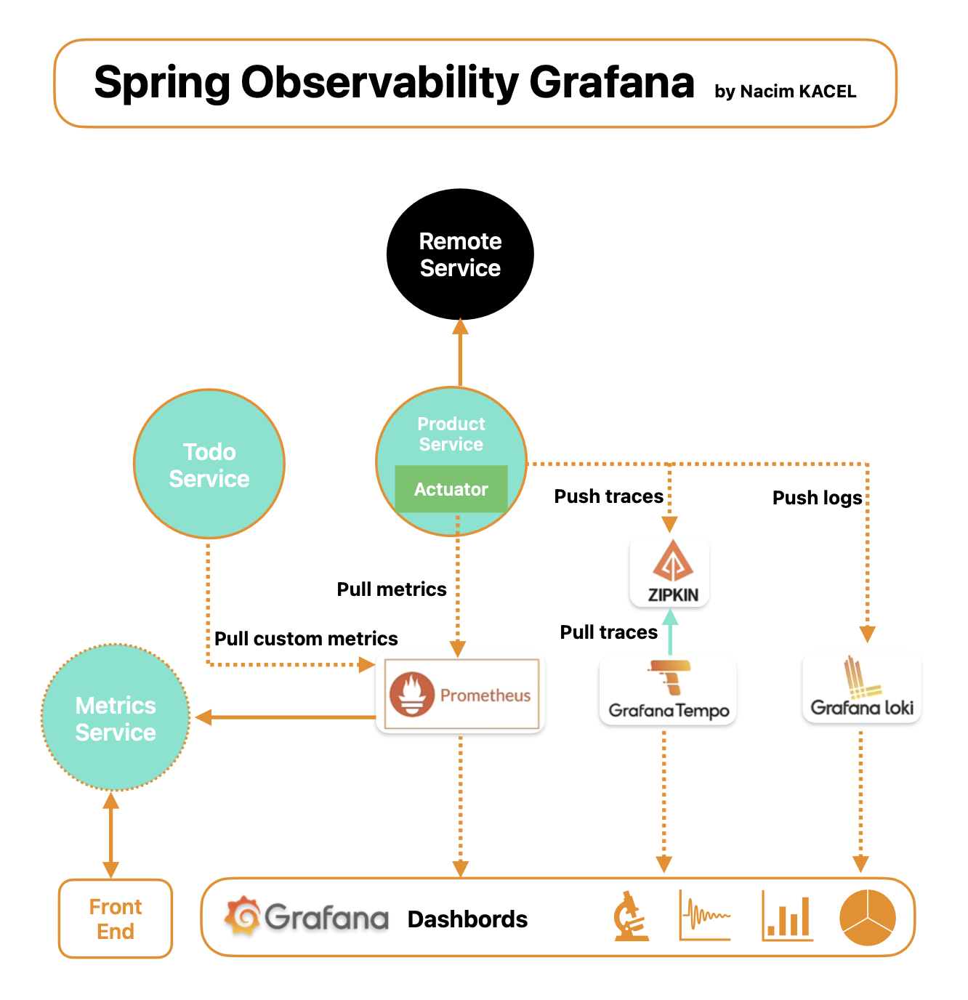

# Spring Observability with Prometheus and Grafana

This project demonstrates how to use Spring Boot with Prometheus and Grafana for observability. It includes a `MetricsController` that allows querying Prometheus metrics over a specified time range.

## Prerequisites

- Java 17 or higher
- Maven
- Prometheus
- Grafana

## How to run :
- mvn clean package
- docker-compose up --build

